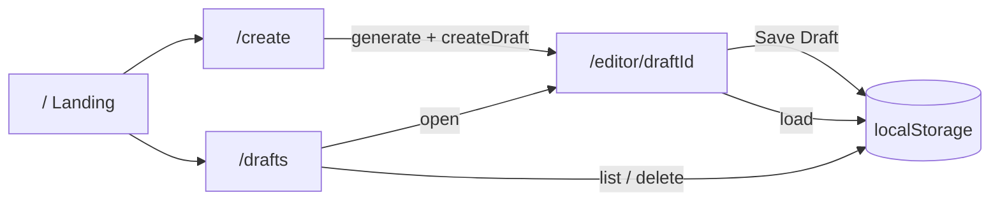
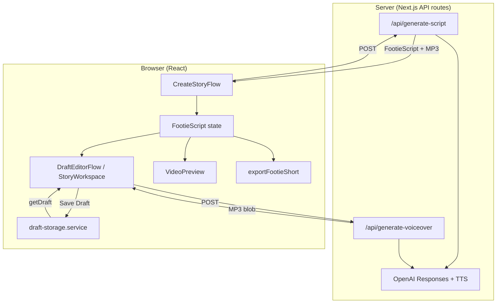
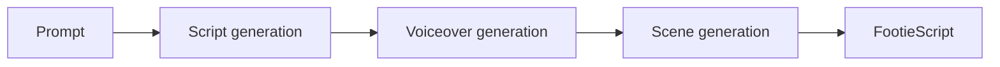
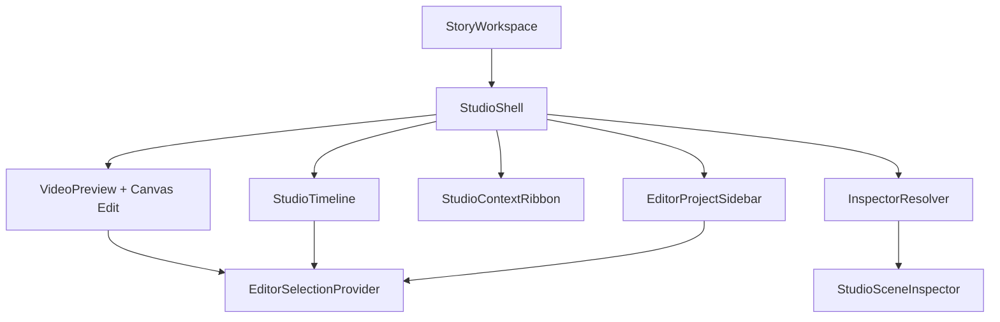
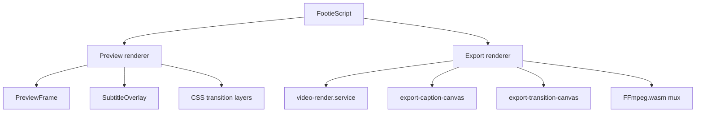

# Architecture

ShortForge Studio is a multi-route Next.js application for creating vertical football documentary shorts. The product shell exposes four main pages — landing, create, editor, and drafts — while the technical core remains three layers: **Generation**, **Editing**, and **Rendering**, all operating on a shared story model (`FootieScript`).

AI work runs on server API routes. Editing, preview, export, and **draft persistence (MVP)** run in the browser. There is no database and no authentication today. Draft JSON is stored in **localStorage** under a single app key; opening `/editor/[draftId]` hydrates React state from that store without calling generation again.

**Planned (not shipped):** cloud-backed drafts and user accounts — see [ROADMAP.md](../ROADMAP.md) Phase 5.

---

## Product routes

| Route | Page | Purpose |
|-------|------|---------|
| `/` | `src/app/page.tsx` + `LandingPage` | Marketing — product overview, links to `/create` and `/drafts` |
| `/create` | `src/app/create/page.tsx` + `CreateStoryFlow` | Story brief → `POST /api/generate-script` → `createDraft()` → redirect `/editor/[draftId]` |
| `/editor/[draftId]` | `src/app/editor/[draftId]/page.tsx` + `DraftEditorFlow` | Load draft via `getDraft(draftId)`; timeline, preview, export; **Save Draft** |
| `/drafts` | `src/app/drafts/page.tsx` + `DraftsDashboard` | List drafts (`listDrafts()`), open or delete |



---

## System overview



---

## Current data flow

The end-to-end path from landing to saved draft to export:

```
Landing (/)
  ↓
Create (/create) → Generate → createDraft → Editor (/editor/[draftId])
  ↓                                              ↓
Save Draft → localStorage                    Preview → Export
  ↓
Drafts (/drafts) → reopen editor
```

### Step-by-step

| Stage | What happens | Key code |
|-------|--------------|----------|
| **Landing** | Marketing page; links to create or drafts | `src/app/page.tsx`, `src/components/LandingPage.tsx` |
| **Create prompt** | User enters topic, tone, duration, scene count, quality on `/create` | `CreateStoryFlow`, `BriefCanvas` |
| **Story** | Server generates title + continuous narration via OpenAI | `script-generation.service.ts`, `lib/ai/prompts.ts` |
| **Voiceover** | Server synthesizes MP3 from narration; duration measured from audio | `voiceover.service.ts` |
| **Story (scenes)** | Server plans timed scenes fitted to voiceover length | `scene-planning.service.ts`, `audio-first-generation.service.ts` |
| **Draft created** | Client calls `createDraft(script)` → redirect `/editor/[draftId]` | `draft-storage.service.ts`, `CreateStoryFlow` |
| **Editor load** | `getDraft(draftId)` hydrates React state; **no AI on open** | `DraftEditorFlow`, `StoryWorkspace` |
| **Editor edits** | User edits scenes, images, captions, transitions | `StudioTimeline`, `StudioSceneInspector`, `src/lib/utils/voiceover.ts` |
| **Save Draft** | `serializeEditorStateForDraft()` → `updateDraft()` → localStorage | `draft-serialization.utils.ts`, `AppShell` |
| **Preview** | React playback with narration-synced clock | `VideoPreview`, `usePreviewPlayback` |
| **Export** | Canvas frame loop + optional FFmpeg mux | `video-render.service.ts`, `ffmpeg.utils.ts` |
| **Drafts** | `listDrafts()` dashboard; open or delete | `DraftsDashboard`, `/drafts` |

```mermaid
sequenceDiagram
  participant User
  participant Create as /create
  participant API as /api/generate-script
  participant Store as localStorage
  participant Editor as /editor/draftId
  participant Preview as VideoPreview
  participant Export as exportFootieShort

  User->>Create: Submit prompt
  Create->>API: POST generate-script
  API-->>Create: FootieScript + voiceover MP3
  Create->>Store: createDraft()
  Create->>Editor: redirect
  Editor->>Store: getDraft(draftId)
  Store-->>Editor: Draft.script
  User->>Editor: Edit timeline
  User->>Editor: Save Draft
  Editor->>Store: updateDraft()
  Editor->>Preview: Same FootieScript
  User->>Export: Render MP4
```

After generation, the editor holds `FootieScript` in React state. **Save Draft** persists to localStorage; reload or reopen from `/drafts` rehydrates from storage. Updates flow through `applyStoryUpdate()` → `syncFootieScript()` before reaching preview and export.

---

## Draft persistence (MVP)

Drafts are the product's project model. Each draft wraps a canonical `FootieScript` plus metadata (id, title, prompt preview, timestamps, status).

| Concern | Implementation |
|---------|----------------|
| Storage | Browser **localStorage**, key `footiebitz:drafts:v1` |
| Create | After successful generation on `/create` |
| Save | Manual **Save Draft** button in `AppShell` (no autosave yet) |
| Load | `getDraft(draftId)` when `/editor/[draftId]` mounts |
| List / delete | `/drafts` via `listDrafts()`, `deleteDraft()` |

**Module:** `src/features/drafts/` — types, `draft-storage.service.ts`, `draft-serialization.utils.ts`, `DraftEditorFlow`, `DraftsDashboard`.

**Limitations (today):**

- Drafts are **local to this browser** — no sync across devices or browsers
- Clearing site data removes all drafts
- **Blob URLs** (voiceover MP3, uploaded images, background music) are not durably stored; they may break after a full page reload until IndexedDB or cloud media ships
- **No authentication** — anyone with access to the browser profile can read drafts

**Planned:** Cloud drafts tied to user accounts (Phase 5). Not implemented.

---

## Layer 1 — Generation

Generation turns a football topic into a timed, narrated story. It runs **server-side only** (`server-only` services) and is orchestrated by the audio-first pipeline.

**Entry point:** `POST /api/generate-script` (`src/app/api/generate-script/route.ts`)  
**Orchestrator:** `generateAudioFirstStory()` (`src/features/story/services/audio-first-generation.service.ts`)



### Prompt

The user's brief is assembled from UI inputs and passed to AI prompt builders.

| Input | Source |
|-------|--------|
| Topic | `BriefCanvas` textarea in `CreateStoryFlow` |
| Tone | `dramatic` \| `funny` \| `tactical` \| `news` \| `emotional` |
| Duration | 15–60 seconds |
| Scene count | 3–12 |
| Quality mode | `cheap` \| `balanced` \| `best` → OpenAI model |

**Prompt templates:** `src/lib/ai/prompts.ts`

- `buildFootieScriptPrompt()` — documentary narration instructions, tone guidance, JSON shape example
- `buildScenePlanPrompt()` — scene breakdown from script + measured audio duration

**Model selection:** `src/lib/ai/script-models.ts` (`gpt-4.1-mini` for cheap, `gpt-4.1` for balanced/best; overridable via `OPENAI_SCRIPT_MODEL`)

### Script generation

Produces a **`StoryScript`**: title + one continuous narration block (not disconnected captions).

| File | Role |
|------|------|
| `services/script-generation.service.ts` | Calls OpenAI Responses API |
| `services/story-parse.service.ts` | JSON extraction and validation |
| `lib/ai/script-schema.ts` | Structured output schema |
| `lib/ai/openai.client.ts` | OpenAI client singleton |

Output type: `StoryScript` in `src/features/story/types/audio-first.types.ts`.

### Voiceover generation

Converts narration text to MP3 and resolves duration for scene timing.

| File | Role |
|------|------|
| `services/voiceover.service.ts` | `generateVoiceoverFromScript()`, `generateVoiceoverMp3()` |
| `utils/voiceover-duration.utils.ts` | Speed-adjusted duration math |
| `lib/audio/mp3-duration.utils.ts` | MP3 length measurement |

- Model: OpenAI `tts-1`
- Default voice: `alloy` (see `lib/utils/voiceoverOptions.ts`)
- Speed presets applied at TTS or adjusted post-generation
- Duration source: measured from MP3, or estimated from word count as fallback

Standalone regeneration: `POST /api/generate-voiceover` — used when the user edits narration or voice settings after initial generation.

### Scene generation

Plans `FootieScene[]` timed to the measured voiceover duration.

| File | Role |
|------|------|
| `services/scene-planning.service.ts` | AI scene plan from script + `voiceoverDurationMs` |
| `utils/audio-first.utils.ts` | Fit scenes to target duration |
| `utils/timeline.utils.ts` | `ensureTimelineItems()`, default transitions |

Each scene receives:

- `subtitle` — AI-generated on-screen caption
- `sceneType` — optional `intro` \| `context` \| `match` \| `transition` \| `ending`
- `narration` — excerpt of full narration for that scene window
- Timings — `attachEvenVoiceoverTiming()` distributes ms across scenes

Final assembly: `syncFootieScript()` normalizes the result into `FootieScript` with `timelineItems`.

### Fallback

If audio-first fails, `/api/generate-script` falls back to legacy `generateFootieScript()` (single JSON call with embedded scenes) and optionally applies voiceover timing via `applyAudioFirstTiming()`.

---

## Layer 2 — Editing

Editing is entirely **client-side**. The production editor mutates `FootieScript` in React state; changes are immediately visible in preview.

**Shell:** `StoryWorkspace` → `StudioShell`  
**Timeline:** `StudioTimeline` (`src/features/timeline-editor/`)  
**Inspector:** `InspectorResolver` → `StudioSceneInspector`  
**State helpers:** `src/lib/utils/voiceover.ts` (`syncFootieScript`, `applyStoryUpdate`, `applySceneUpdate`)

### Studio Shell

`StudioShell` (`src/components/studio-shell/`) is the editor layout frame:

| Region | Component | Role |
|--------|-----------|------|
| Header | `EditorStudioHeader` | Project title, Save Draft, Export |
| Sidebar | `EditorProjectSidebar` | Scene list, quick jump, voiceover status |
| Canvas | `VideoPreview` + `StudioContextRibbon` | 9:16 preview and image quick actions |
| Inspector | `InspectorResolver` | Selection-driven property panels |
| Timeline | `StudioTimeline` | Horizontal scene rail, reorder, playhead |

Mobile uses a bottom action bar for Scenes / Preview / Download.

### Selection Engine

`EditorSelectionProvider` (`src/features/editor/selection/`) owns editor focus state:

- Selected scene index and id
- Image-edit mode (canvas pan/zoom drag)
- Ribbon visibility (`image` context when a scene has an image)
- Playback lock (blocks canvas edit during preview/export)

Selection phases: `Idle` → `Selected` → `Hover` → `Editing` → `PlaybackLocked`. Preview, sidebar, timeline, ribbon, and inspector all read the same selection context.

### Inspector Registry

Inspectors resolve from selection via `InspectorRegistry` (`src/features/editor/inspector/`):

| Panel id | Component | When shown |
|----------|-----------|------------|
| `scene` | `SceneInspector` → `StudioSceneInspector` | Scene selected |
| `image`, `caption`, `transition`, `audio` | Placeholder panels | Registered; scene panel is primary today |
| `project` | `ProjectInspector` → `EditorProjectInspector` | Story-level voice + review |

`InspectorResolver` calls `registry.resolve(selection)` and renders matching `InspectorPanel` stacks.

### Context Ribbon

`StudioContextRibbon` shows contextual quick actions above the preview canvas. When an image scene is selected, `ImageRibbonContext` exposes fit/fill, reset, and replace-image without opening the full inspector.

### Canvas Editing System

With `enableCanvasEdit` on `VideoPreview`:

- **`EditorCanvasEditLayer`** — drag pan on the active scene image
- **`EditorCanvasSelectionLayer`** — selection chrome and guides
- Image transform patches flow through `applySceneImageSettings()` / `applyResetSceneImageSettings()`
- Canvas edit is disabled during playback and export

### Timeline Editor v1

`StudioTimeline` replaces the legacy vertical storyboard stack:

| Operation | Implementation |
|-----------|----------------|
| Select scene | Click scene block → updates selection |
| Reorder | Drag scene blocks on the rail |
| Add / duplicate / delete | Context menu + `timeline-editor.commands.ts` |
| Playhead | `TimelinePlaybackHead` synced from preview clock via `TimelinePlaybackPort` |
| Transitions | `TimelineTransitionMarker` between scene blocks |

Scene CRUD still uses `timeline.utils.ts` and `src/lib/utils/voiceover.ts` helpers under the hood.

### Scene inspector (production editing surface)

`StudioSceneInspector` is the per-scene editing surface (duration, type, captions, image upload, motion, transitions):

| Concern | UI |
|---------|-----|
| Duration, scene type | Inspector fields |
| Image upload / remove | `MediaPicker`, `useSceneImageUpload` |
| Fit / fill / zoom | Context ribbon + inspector; canvas drag for pan |
| Ken Burns motion | `MotionPanel` / `SceneImageMotionControl` |
| Caption mode & copy | `CaptionModeControl`, textareas |
| Subtitle effects | `SubtitleEffectControl` |
| Transitions | `TransitionCard` for outgoing transition |
| Smart Edit handoff | `SmartEditImageAction` opens external image tool |

### Smart Edit (manual handoff)

Advanced image editing uses an **external tool handoff** — not an in-app canvas:

- `SmartEditImageAction` builds a URL via `buildSmartEditImageToolUrl()` (`src/lib/utils/smart-image-tool.utils.ts`)
- Opens the Smart Edit tool in a new tab/window with `draftId`, `sceneId`, and return route
- Creator saves in the external tool; image returns via the existing upload/replace flow

Optional landing route: `/tool` (`SmartImageToolBridge`).



### Image upload

- **`MediaPicker`** — file input → `blob:` URL
- Stored on scene as `SceneImage.url` (legacy `uploadedImage` strings migrate on sync)
- **`sceneHasImage()`** / **`getSceneImageUrl()`** — read helpers in `scene.utils.ts`

### Image positioning

Pan position stored as normalized `x`, `y` offsets on `SceneImage`.

- Editor: **`EditorCanvasEditLayer`** + **`SceneFrameImage`** — drag on desktop and touch
- Patches via `applySceneImageSettings()` in `src/lib/utils/voiceover.ts`
- Draw: **`drawSceneImageInFrame()`** in `scene.utils.ts` (shared by preview and export)

### Fit / Fill

`SceneImage.fitMode`:

| Mode | Behavior |
|------|----------|
| `fit` | Full image visible inside 9:16 frame (letterbox) |
| `fill` | Image covers frame (may crop) |

Control: **Context ribbon** (`ImageRibbonContext`) and **inspector** image section.

### Zoom

Manual zoom multiplier on `SceneImage.scale`. Combined at render time with image motion scale (see below).

### Caption modes

Per-scene `captionMode` (`src/features/story/utils/caption.utils.ts`):

| Mode | On-screen source |
|------|------------------|
| `generated` (default) | AI scene `subtitle` — static for full scene |
| `subtitles` | `subtitleText` split into timed chunks from narration |

Toggle: **`CaptionModeControl`** in `StudioSceneInspector`.

### Subtitle editing

In subtitles mode:

- User edits `subtitleText` in the scene inspector
- **`splitSubtitleChunks()`** (`subtitle.utils.ts`) breaks text into phrase chunks (max ~5 words / 34 chars)
- Chunks timed evenly across scene duration
- Effects: **`SubtitleEffectControl`** — `fade-up`, `typewriter`, `highlight`
- Preview rendering: **`subtitleEffectPreview.tsx`**, **`SubtitleOverlay.tsx`**
- Max 3 visible lines, 90% frame width (`SUBTITLE_MAX_VISIBLE_LINES`, `SUBTITLE_MAX_WIDTH_RATIO`)

### Voice settings

Story-level `FootieScript.voiceSettings`:

- Voice — OpenAI TTS voice id
- Speed — 0.75x to 1.4x presets

UI: **`ProjectAudioStudio`** in `EditorProjectInspector` (`ProjectAudioVoiceoverSection`, `ProjectAudioBackgroundMusicSection`, export mix summary). Review flow: **`VoiceSettingsCard`** → `/api/generate-voiceover`.

### Scene duration editing

- Range: 1–20 seconds per scene
- Sets `durationSource: "manual"` via `applyManualDurationPatch()`
- **`recalculateSceneTimings()`** updates cumulative `startMs` / `endMs` for all scenes
- Story `totalDuration` = sum of scene durations

Manual edits change visual pacing only; the voiceover MP3 is not re-stretched unless the user regenerates narration.

### Transitions

Transition cards (`TransitionTimelineItem`) sit between scenes in `timelineItems`. They are editor metadata — not AI-generated.

| Property | Description |
|----------|-------------|
| `effect` | `cut`, `fade`, `slide-left`, `slide-right`, `zoom-in`, `zoom-out`, `blur` |
| `durationMs` | Overlay length, capped at 40% of outgoing scene |

UI: **`TransitionCard`** in scene inspector; markers on **`StudioTimeline`**. Logic: **`transition-overlay.utils.ts`**.

**Model:** Transitions render as a **tail overlay** on the outgoing scene only. They do not extend total timeline duration. Captions hide during the overlay window.

### Image Motion (Ken Burns)

Optional slow zoom during scene playback, on top of manual pan/zoom.

| Field | Values |
|-------|--------|
| `imageMotion.type` | `none`, `zoom-in`, `zoom-out` |
| `imageMotion.intensity` | `subtle` (→1.05×), `medium` (→1.10×), `strong` (→1.16×) |

- Math: **`scene-image-motion.utils.ts`** — driven by Master Timeline image-motion track
- UI: **`MotionPanel`** / **`SceneImageMotionControl`** in scene inspector
- Progress is linear from scene start (0) to scene end (1)

---

## Timeline Intelligence Runtime

Preview and export share one **Master Timeline** built from `FootieScript`:

```
FootieScript → buildMasterTimeline() → optimizeMasterTimeline() → preview / export clocks
```

Tracks: scenes, subtitles, caption animations, image motion, transitions, audio.  
**Module:** `src/features/timeline-intelligence/`  
**Authority:** `renderDurationMs` spans narration, scenes, subtitles, and transition tails.

Deep dive: [README.md — Timeline Intelligence Runtime](../README.md#timeline-intelligence-runtime)

---

## Content Intelligence / Story Structure Intelligence

Research-backed generation runs before script writing:

```
User Brief → Intent → Entity/Competition Resolution → Provider Registry → Knowledge Graph
  → Graph Context → Prompt Intelligence → OpenAI
```

**Modules:** `src/features/intelligence/`, `src/features/research/`  
**Story structure QA:** `src/verification/research/storyStructureIntelligenceQa.verify.ts`  
Prompt Intelligence is the primary production prompt path; Graph Context is fallback.

Deep dive: [README.md — Intelligence Runtime](../README.md#intelligence-runtime)

---

## Studio Intelligence layer

Studio Intelligence produces `StudioIntelligenceResult` from narration and story mode under `src/features/studio-intelligence/`. **3.5 Production Wiring** connects it to scene generation on the Review **scenes-only** path behind **dual gates**. Default production behavior remains the AI scene planner.

### Default production path (unchanged)

```
Generation (audio-first or scenes-only, SI gates closed)
  ↓
AI scene planner (OpenAI)
  ↓
FootieScript
  ↓
Timeline Intelligence (Master Timeline)
  ↓
Studio (Editor · Preview · Export)
```

`POST /api/generate-script` produces `FootieScript` via script generation, voiceover (when applicable), and AI scene planning. Timeline Intelligence, editor, preview, and export are **unchanged** by Studio Intelligence 3.5.

### Opt-in SI path (scenes-only v1, dual gates)

When **both** `STUDIO_INTELLIGENCE_SCENE_PLAN_ENABLED=true` **and** `useStudioIntelligenceScenes=true`:

```
Review scenes-only request
  ↓
runStudioIntelligence()
  ↓
adaptSceneDensity(requestedSceneCount)
  ↓
mapBlueprintsToScenes()
  ↓
materializeMappedScenesToFootieScript()
  ↓
FootieScene[]  →  same FootieScript downstream contract
  ↓
Timeline Intelligence → Editor · Preview · Export
```

**Fallback:** Any SI, density, adapter, or materializer failure → AI scene planner (same response shape).

**Not wired:** Audio-first `full` mode, Create one-shot flow, editor, preview, export, audio, timeline intelligence, drafts.

**Dev/staging:** Review toggle “Use Studio Intelligence scene planning”; hidden in production unless `NEXT_PUBLIC_STUDIO_INTELLIGENCE_SCENE_PLAN_TOGGLE=true`. Optional dev badge (*Studio Intelligence used* / *AI fallback* / *Scene density adapted*); no raw diagnostics in production UI.

### Planning pipeline (3.3)

```
Story Input (StudioIntelligenceInput)
  ↓
runStudioIntelligence()
  ↓
resolveStoryStrategy(mode)
  ↓
Beat Detection → Arc Builder → Scene Planner → Visual Planner → Dynamic Timing
  ↓
StudioIntelligenceResult
```

**Module:** `src/features/studio-intelligence/`  
**Production bridge:** `src/features/story/services/studio-intelligence-scene-plan.utils.ts`  
**Verification:** `src/verification/studio-intelligence/*.verify.ts`  
**Deep dive:** [STUDIO_INTELLIGENCE.md](./STUDIO_INTELLIGENCE.md)

---

## Layer 3 — Rendering

Rendering turns `FootieScript` into visible frames. Two renderers exist — **Preview** (React/CSS) and **Export** (Canvas 2D) — sharing the same timing and layout utilities from `src/features/story/utils/`.



### Preview renderer

**Component tree:** `VideoPreview` → `PreviewFrame` → `SceneFrameImage` / placeholders

| File | Role |
|------|------|
| `preview/components/VideoPreview.tsx` | Playback controls, device frame, audio element |
| `preview/components/PreviewFrame.tsx` | Composites background + image + transition layers |
| `preview/hooks/usePreviewPlayback.ts` | Play/pause, clock, scene index |
| `preview/utils/previewTimeline.ts` | `getPreviewFrameAtTime()` — active scene at elapsed sec |
| `preview/utils/previewSceneTiming.ts` | Scene-local elapsed ms for selected scene |

Frame composition order:

1. Scene background (image or type-coloured placeholder)
2. Image motion scale on `SceneFrameImage`
3. Transition overlay (dual CSS layers via `getTransitionLayerStyles()`)
4. Captions (hidden during transition overlay)

Aspect ratio: **9:16** inside a phone-style device frame.

### Export renderer

**Entry:** `exportFootieShort()` in `src/features/export/services/video-render.service.ts`

Pipeline:

1. **`buildFootieExportPayload()`** — normalize to `ExportScene[]` (`export-payload.service.ts`)
2. Preload scene images
3. Create offscreen canvas at chosen resolution (720p–4K)
4. **`MediaRecorder`** on `canvas.captureStream(30 fps)` → WebM
5. Per-frame: clear → draw scene → draw transition → draw captions
6. Optional: **`ffmpeg.utils.ts`** muxes narration MP3 into final WebM

Quality presets: `export-quality.utils.ts` (720p, 1080p, 1440p, 4K vertical @ 30 fps).

### Subtitle renderer

Two caption paths, both in **`export-caption-canvas.utils.ts`**:

| Mode | Function | Behavior |
|------|----------|----------|
| Generated | `drawExportGeneratedCaption()` | Static wrapped text for scene duration |
| Subtitles | `drawExportSubtitlesCaption()` | Active chunk + effect animation per frame |

Subtitle display resolution: **`export-subtitle.utils.ts`** → `resolveExportSubtitleDisplay()` picks active chunk and effect progress from scene elapsed ms.

Export pill styling: content-sized rounded rectangle, `rgba(0,0,0,0.45)`, white text, bottom-centred at `subtitleY = height - 320 × scale`.

Preview equivalent: **`SubtitleOverlay.tsx`** + **`subtitleEffectPreview.tsx`** (CSS pill at `bottom: 8%`).

Shared chunk/progress math:

- Preview: `getActiveSubtitleChunkState()` (`subtitle-timing.utils.ts`)
- Export: `resolveExportSubtitleDisplay()` — must stay aligned (guarded by `test:export-subtitle-qa`)

### Voice synchronization

During preview playback with narration:

- **`usePreviewPlayback`** drives global elapsed time from the `<audio>` element when `playbackMode === "narration"`
- Visual scene index derived from global ms via `getSceneTimingAtGlobalTime()`
- Narration plays as one continuous track; scene boundaries are visual only
- Scene-local subtitle chunk progress uses `sceneElapsedMs / sceneDurationMs`

Export:

- Video frames timed by story duration (sum of scene ms)
- Narration muxed via FFmpeg.wasm; audio length may differ slightly from visual total if durations were manually edited after generation

### Transition renderer

Shared resolver: **`resolveSceneTransitionOverlay()`** in `transition-overlay.utils.ts`

| Renderer | Implementation |
|----------|------------------|
| Preview | CSS transforms/opacity on dual layers in `PreviewFrame` |
| Export | `drawExportTransitionBackgrounds()` in `export-transition-canvas.utils.ts` |

Overlay window: final N ms of outgoing scene (`clampOverlayTransitionDurationMs()`). Progress 0→1 across that window. Captions suppressed while overlay is active.

---

## Folder structure

```
footiebitz/src/
├── app/
│   ├── page.tsx                      # Landing (/)
│   ├── create/page.tsx               # Story generation (/create)
│   ├── create/review/[draftId]/      # Script review
│   ├── editor/[draftId]/page.tsx     # Editor (/editor/[draftId])
│   ├── drafts/page.tsx               # Draft dashboard (/drafts)
│   ├── tool/page.tsx                 # Optional Smart Edit landing
│   └── api/                          # generate-script, generate-voiceover, intelligence, research
│
├── components/
│   ├── studio-shell/                 # StudioShell, ContextRibbon, ExportDrawer
│   ├── StoryWorkspace.tsx            # Editor orchestration
│   ├── LandingPage.tsx
│   └── layout/AppShell.tsx           # Header incl. Save Draft
│
├── features/
│   ├── create/                       # CreateStoryFlow, BriefCanvas, script review
│   ├── drafts/                       # Draft model + localStorage
│   ├── editor/                       # Selection, inspector registry, scene inspector
│   ├── timeline-editor/              # StudioTimeline v1 rail
│   ├── timeline-intelligence/        # Master Timeline, optimizer, schedulers
│   ├── studio-intelligence/          # Planning-only: beats → arcs → blueprints (3.3)
│   ├── intelligence/                 # Intent, entities, graph, prompt intelligence
│   ├── research/                     # Research context integration
│   ├── story/                        # Domain model, generation, shared utils
│   ├── preview/                      # VideoPreview, playback
│   ├── export/                       # Canvas render, FFmpeg mux
│   └── tool/                         # SmartEditImageAction, external tool bridge
│
├── lib/
│   ├── ai/                           # Prompts, schema, OpenAI client
│   ├── audio/                        # MP3 duration helpers
│   ├── constants/                    # Product metadata, navigation, studio constants
│   ├── football/                     # API-Football client
│   └── utils/                        # voiceover state helpers, studioUi, blob URLs
│
├── verification/                     # QA scripts (*.verify.ts) — not imported by production
│   ├── audio/, canonical/, drafts/, editor/, entity/, export/
│   ├── football/, graph/, research/, timeline/, ui/, utils/
│   ├── studio-intelligence/          # Studio Intelligence 3.3 verification scripts
│   └── README.md
│
├── hooks/
└── types/
```

### Verification layout

Regression scripts live under `src/verification/<domain>/`. Naming:

| Pattern | Purpose |
|---------|---------|
| `<feature>.verify.ts` | Focused contract test for one subsystem |
| `<feature>Qa.verify.ts` | Broader QA; often asserts cross-file invariants |

Run via `npm run test:<feature>` or batch domains: `npm run test:verification`, `test:verification:export`, etc.  
`tsconfig.json` excludes `**/*.verify.ts` from the production build.

---

## Server vs client boundary

| Concern | Location |
|---------|----------|
| OpenAI API calls | Server (`features/story/services/`, marked `server-only`) |
| `OPENAI_API_KEY` | Server environment only |
| `FootieScript` state | Client React state (editor routes) |
| Draft JSON persistence | Client **localStorage** (`draft-storage.service.ts`) |
| Image / audio blob URLs | Client (file upload, voiceover response) |
| Preview rendering | Client React |
| Export rendering | Client Canvas + MediaRecorder |
| FFmpeg.wasm | Client (dynamic import) |
| User accounts / cloud drafts | **Not implemented** (planned Phase 5) |

---

## Shared logic between preview and export

Preview and export intentionally call the same pure functions so visual output stays aligned:

| Concern | Shared utility |
|---------|----------------|
| Global → scene timing | `getSceneTimingAtGlobalTime()` |
| Scene duration | `getSceneDurationMs()` |
| Subtitle chunks | `splitSubtitleChunks()`, chunk progress math |
| Transitions | `resolveSceneTransitionOverlay()` |
| Image draw | `drawSceneImageInFrame()`, `resolveSceneImageMotionScale()` |
| Caption mode | `normalizeCaptionMode()` |

Regression tests in `src/verification/` enforce parity (e.g. `test:export-subtitle-qa`, `test:transition-qa`, `test:timing-subtitle-qa`). See `src/verification/README.md`.

---

## Related documentation

| Document | Contents |
|----------|----------|
| [GENERATION.md](./GENERATION.md) | AI pipeline details |
| [STUDIO_INTELLIGENCE.md](./STUDIO_INTELLIGENCE.md) | Studio Intelligence 3.3 planning subsystem |
| [EDITING.md](./EDITING.md) | Editor feature reference |
| [RENDERING.md](./RENDERING.md) | Canvas and FFmpeg internals |
| [DATA_MODEL.md](./DATA_MODEL.md) | Type definitions |
| [FEATURES.md](./FEATURES.md) | Implemented capability list |
