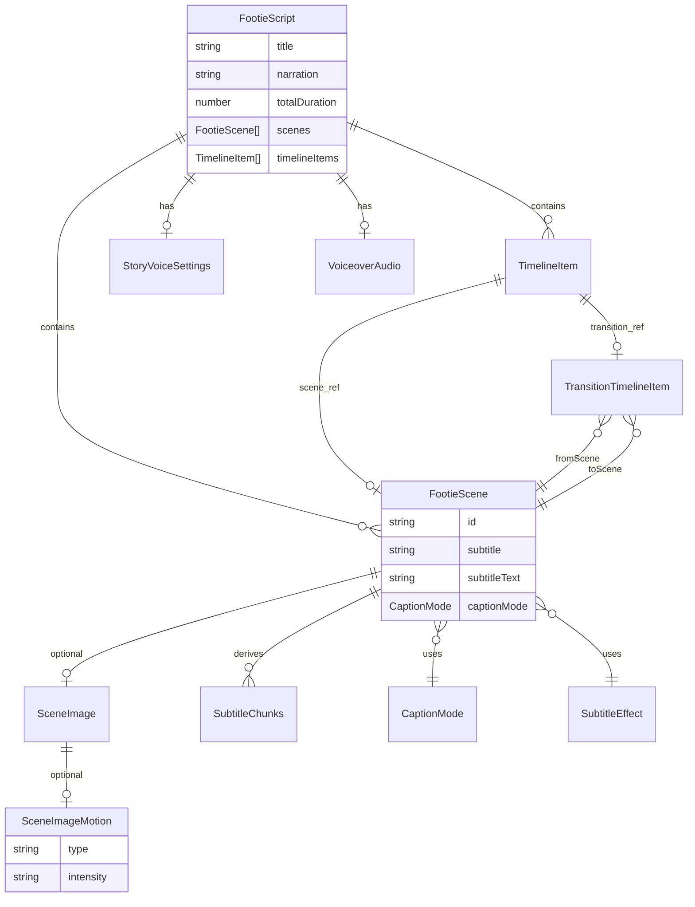

# Data Model

ShortForge Studio stores all studio state in a single in-memory **`FootieScript`** object on the client. Drafts persist to browser **localStorage** via `draft-storage.service.ts`.

**Source of truth:** `src/features/story/types/story.types.ts`  
**Normalization:** `syncFootieScript()` in `src/lib/utils/voiceover.ts`  
**Render snapshot:** `ExportScene` in `src/features/export/services/export-payload.service.ts`

---

## Entity relationship overview



**Cardinality:**

- One **Story** (`FootieScript`) has many **Scenes**
- One **Story** has one **VoiceSettings** object and one voiceover audio URL
- One **Scene** has zero or one **Image** (with optional **ImageMotion**)
- One **Timeline** interleaves scene references and **Transition** items between adjacent scenes
- **Subtitle chunks** are derived at render time from scene text — not stored

---

## Story

The root document. In code this is `FootieScript`; referred to as "story" in the UI.

```typescript
interface FootieScript {
  /** Display title for the short. */
  title: string;

  /** Full spoken narration — one continuous documentary script. */
  narration: string;

  /** Sum of scene durations in seconds. Recalculated on sync. */
  totalDuration: number;

  /** Ordered list of production scenes. */
  scenes: FootieScene[];

  /** Interleaved scene + transition items. Auto-built if omitted. */
  timelineItems?: TimelineItem[];

  /** Client blob URL or remote URL for generated narration MP3. */
  voiceoverUrl?: string;

  /** Measured or estimated narration length in milliseconds. */
  voiceoverDurationMs?: number;

  /** Story-level TTS preferences. */
  voiceSettings?: StoryVoiceSettings;
}
```

### Field editability

| Field | User editable? | How |
|-------|----------------|-----|
| `title` | ✅ Yes | `StoryReview` input |
| `narration` | ✅ Yes | `StoryReview` textarea |
| `totalDuration` | ❌ Computed | Sum of scene durations; displayed read-only |
| `scenes` | ✅ Yes | Timeline editor (add/delete/reorder/duplicate) |
| `timelineItems` | ✅ Partial | Transitions editable; scene items sync from `scenes` |
| `voiceoverUrl` | ⚙️ Indirect | Set by generation or **Apply Changes**; cleared when narration text changes |
| `voiceoverDurationMs` | ⚙️ Indirect | Updated when voiceover is generated/applied |
| `voiceSettings` | ✅ Yes | `VoiceSettingsCard` (voice + speed selectors) |

### Server-only generation types

These exist during AI pipeline execution but collapse into `FootieScript` on the client:

```typescript
/** Narration script before scene planning. Server pipeline only. */
interface StoryScript {
  id: string;
  title: string;
  narration: string;
  estimatedDurationMs?: number;
}

/** Full audio-first pipeline output. Included in API response. */
interface AudioFirstGenerationResult {
  script: StoryScript;
  voiceover: VoiceoverResult | null;
  scenes: FootieScene[];
  timelineItems: TimelineItem[];
}

interface VoiceoverResult {
  durationMs: number;
  provider: "openai" | string;
  audioBase64?: string;   // server response
  audioUrl?: string;    // client blob URL after attach
  metadata?: VoiceoverMetadata;
}
```

---

## Scene

One visual beat in the production timeline. Scenes control **when** images and captions appear — not the narration audio file itself.

```typescript
type SceneType = "intro" | "context" | "match" | "transition" | "ending";

type SceneDurationSource = "manual" | "voiceover";

interface FootieScene {
  /** Stable unique id. Used by timeline and transition references. */
  id: string;

  // ── Timing (seconds — display) ──────────────────────────────────────────
  start: number;
  end: number;
  duration: number;

  // ── Timing (milliseconds — playback/export) ─────────────────────────────
  startMs?: number;
  endMs?: number;
  durationMs?: number;
  durationSource?: SceneDurationSource;

  // ── Content ─────────────────────────────────────────────────────────────
  /** AI-generated on-screen caption (generated mode). */
  subtitle: string;

  /** Optional structural label for placeholders and editor UX. */
  sceneType?: SceneType;

  /** Per-scene voiceover excerpt — timing reference, read-only in UI. */
  narration?: string;

  // ── Media ───────────────────────────────────────────────────────────────
  image?: SceneImage;
  /** @deprecated Migrated to `image` on sync. */
  uploadedImage?: string;

  // ── Captions ────────────────────────────────────────────────────────────
  captionMode?: CaptionMode;       // default: "generated"
  subtitleEffect?: SubtitleEffect; // default: "fade-up"
  /** Editable on-screen copy when captionMode is "subtitles". */
  subtitleText?: string;
}
```

### Field editability

| Field | User editable? | How |
|-------|----------------|-----|
| `id` | ❌ System | Assigned on create/duplicate; normalized on sync |
| `start`, `end` | ❌ Computed | Derived from cumulative durations |
| `duration` | ✅ Yes | Number input on `StudioSceneInspector` (1–20 seconds) |
| `startMs`, `endMs`, `durationMs` | ❌ Computed | Set by `recalculateSceneTimings()` |
| `durationSource` | ⚙️ Indirect | `"manual"` on duration edit; `"voiceover"` from generation/refit |
| `subtitle` | ✅ Yes | Textarea when `captionMode === "generated"` |
| `sceneType` | ✅ Yes | Select on `StudioSceneInspector` |
| `narration` | ❌ Derived | Excerpt from story narration; synced on generation/refit |
| `image` | ✅ Yes | Upload, pan, zoom, fit, motion (see Image + ImageMotion) |
| `uploadedImage` | ⚙️ Legacy | Migrated to `image`; not edited directly |
| `captionMode` | ✅ Yes | `CaptionModeControl` toggle |
| `subtitleEffect` | ✅ Yes | `SubtitleEffectControl` (subtitles mode) |
| `subtitleText` | ✅ Yes | Textarea when `captionMode === "subtitles"` |

### Scene operations (structural edits)

These modify the `scenes` array itself:

| Operation | Effect |
|-----------|--------|
| Add | New scene with default 3s duration |
| Delete | Removes scene + linked transitions |
| Duplicate | Clones scene including image settings |
| Move up/down | Reorders; recalculates all timings |
| Add buffer | Quick-insert typed scene (Intro, Context, etc.) |

---

## VoiceSettings

Story-level narrator preferences. One per story — not per scene.

```typescript
interface StoryVoiceSettings {
  /** OpenAI TTS voice id. Default: "alloy". */
  voice?: string;

  /** Playback speed preset. Default: 1.0 */
  speed: number;  // 0.75 | 0.9 | 1 | 1.1 | 1.25 | 1.4
}
```

### Field editability

| Field | User editable? | How |
|-------|----------------|-----|
| `voice` | ✅ Yes | Select in `VoiceSettingsCard` |
| `speed` | ✅ Yes | Speed chips in `VoiceSettingsCard` |

**Important:** Changing voice or speed updates **preferences only** via `applyStoryVoiceSettings()`. The audio file does not change until the user clicks **Apply Changes**, which calls `/api/generate-voiceover` and runs `applyVoiceoverChanges()`.

### Relationship to voiceover audio

```
StoryVoiceSettings (prefs)  ──Apply Changes──▶  voiceoverUrl + voiceoverDurationMs
                                                      │
                                                      ▼
                                              refitScenesToVoiceoverDuration()
                                              (proportional scene timing update)
```

Editing `narration` text clears `voiceoverUrl` (stale audio) but preserves `voiceSettings` prefs.

---

## Subtitle

Subtitles in ShortForge Studio are not a separate stored entity. They are represented across several scene fields plus **derived chunk data** computed at render time.

### Stored fields (on `FootieScene`)

```typescript
type CaptionMode = "generated" | "subtitles";
type SubtitleEffect = "fade-up" | "typewriter" | "highlight";
```

| Mode | Primary text field | Behaviour |
|------|-------------------|-----------|
| `generated` | `subtitle` | Static caption for full scene duration |
| `subtitles` | `subtitleText` | Timed chunks across scene duration |

Supporting fields:

| Field | Purpose |
|-------|---------|
| `captionMode` | Selects generated vs subtitles path |
| `subtitleEffect` | Animation style for on-screen text |
| `narration` | Source excerpt for seeding `subtitleText`; read-only context |

### Derived subtitle model (not persisted)

Computed by `splitSubtitleChunks()` in `subtitle.utils.ts`:

```typescript
/** Runtime-only — not stored on FootieScene */
interface SubtitleChunkState {
  /** Full list of phrase chunks for the scene. */
  chunks: string[];

  /** Active chunk at current elapsed time. */
  activeChunk: string;

  /** Index of active chunk (0-based). */
  chunkIndex: number;

  /** Progress within active chunk (0–1). */
  progress: number;

  /** Ms elapsed within active chunk. */
  chunkElapsedMs: number;

  /** Duration of active chunk in ms. */
  activeChunkDurationMs: number;
}
```

### Chunking rules

| Rule | Value |
|------|-------|
| Max words per chunk | 5 |
| Max chars per chunk | 34 |
| Max visible lines (wrap) | 3 |
| Max pill width | 90% of frame |
| Chunk timing | Equal division of `sceneDurationMs` |

### Field editability

| Concept | User editable? | How |
|---------|----------------|-----|
| Caption mode | ✅ Yes | Per-scene toggle |
| Generated caption (`subtitle`) | ✅ Yes | Textarea |
| Subtitle copy (`subtitleText`) | ✅ Yes | Textarea in subtitles mode |
| Subtitle effect | ✅ Yes | Per-scene selector |
| Chunk boundaries | ❌ Algorithm | Auto-split from text; no manual editor |
| Chunk timing | ❌ Computed | Even split across scene duration |
| `narration` excerpt | ❌ Derived | Synced from story narration on generation/refit |

### Export snapshot fields

`ExportScene` adds resolved subtitle data for rendering:

```typescript
interface ExportScene extends FootieScene {
  captionMode: CaptionMode;        // resolved default
  subtitleText: string;            // resolved
  subtitleEffect: SubtitleEffect;  // resolved default
  subtitleChunks: string[];        // computed from subtitleText
  displayCaption: string;          // renderer convenience
  durationMs: number;              // required
  startMs: number;
  endMs: number;
}
```

---

## Transition

Visual effect metadata between two adjacent scenes. Stored in the timeline — **not** as a scene, **not** rendered as on-screen text.

```typescript
type TransitionEffect =
  | "cut"
  | "fade"
  | "slide-left"
  | "slide-right"
  | "zoom-in"
  | "zoom-out"
  | "blur";

interface TransitionTimelineItem {
  id: string;
  type: "transition";
  fromSceneId: string;
  toSceneId: string;
  effect: TransitionEffect;
  durationMs: number;
  label: string;   // editor display only — never rendered in video
}
```

### Render behaviour

Transitions are **tail overlays** on the outgoing scene:

- Active during the final N ms of `fromScene` (N = `durationMs`, capped at 40% of scene duration)
- Do not extend total timeline duration
- Captions hidden during overlay window
- Resolved at render time by `resolveSceneTransitionOverlay()`

### Field editability

| Field | User editable? | How |
|-------|----------------|-----|
| `id` | ❌ System | Assigned on insert |
| `type` | ❌ Fixed | Always `"transition"` |
| `fromSceneId`, `toSceneId` | ❌ System | Set when transition inserted between scenes |
| `effect` | ✅ Yes | Select on `TransitionCard` |
| `durationMs` | ✅ Yes | Select on `TransitionCard` (300/500/800/1000 ms) |
| `label` | ❌ Fixed | `"Transition to next scene"` — editor only |

Defaults on insert: `fade`, 500 ms.

---

## ImageMotion

Ken Burns-style zoom applied during scene playback. Nested inside `SceneImage` — not a top-level entity.

```typescript
type SceneImageMotionType = "none" | "zoom-in" | "zoom-out";
type SceneImageMotionIntensity = "subtle" | "medium" | "strong";

interface SceneImageMotion {
  type: SceneImageMotionType;
  intensity: SceneImageMotionIntensity;
}
```

### Scale peaks by intensity

| Intensity | Peak scale multiplier |
|-----------|----------------------|
| `subtle` | 1.05× |
| `medium` | 1.10× |
| `strong` | 1.16× |

Progress is linear from scene start (0) to scene end (1). Applied as an additional scale multiplier on top of manual zoom.

### Parent: SceneImage

```typescript
type SceneImageFitMode = "fill" | "fit";

interface SceneImage {
  url: string;
  scale: number;       // manual zoom: 0.5 – 3.0
  x: number;           // pan offset (normalized)
  y: number;
  rotation?: number;   // exists on type; no UI control yet
  fitMode?: SceneImageFitMode;
  imageMotion?: SceneImageMotion;
}
```

### Field editability

| Field | User editable? | How |
|-------|----------------|-----|
| `imageMotion.type` | ✅ Yes | `SceneImageMotionControl` |
| `imageMotion.intensity` | ✅ Yes | `SceneImageMotionControl` |
| `url` | ✅ Yes | File upload / remove on `StudioSceneInspector` |
| `scale` | ✅ Yes | Zoom slider |
| `x`, `y` | ✅ Yes | Drag on `SceneFrameImage` |
| `fitMode` | ✅ Yes | Fit/Fill toggle |
| `rotation` | ❌ No UI | Field exists; not exposed in editor |

Defaults when omitted: `type: "none"`, `intensity: "subtle"`, `scale: 1`, `fitMode: "fit"`.

---

## Timeline

The ordered production sequence interleaving scenes and transitions.

```typescript
type TimelineItem = SceneTimelineItem | TransitionTimelineItem;

interface SceneTimelineItem {
  id: string;
  type: "scene";
  scene: FootieScene;   // full scene object embedded by reference
}

interface TransitionTimelineItem {
  id: string;
  type: "transition";
  fromSceneId: string;
  toSceneId: string;
  effect: TransitionEffect;
  durationMs: number;
  label: string;
}
```

### Dual representation

ShortForge Studio stores scenes in two places:

1. **`FootieScript.scenes`** — authoritative ordered array used for timing math
2. **`FootieScript.timelineItems`** — interleaved view for editor rendering

```
timelineItems: [
  { type: "scene", scene: Scene1 },
  { type: "transition", fromSceneId: "1", toSceneId: "2", ... },
  { type: "scene", scene: Scene2 },
  ...
]
```

`syncFootieScript()` keeps both in sync:

- Scene structural changes → rebuild timeline items via `syncTimelineItemsWithScenes()`
- Transition-only edits → preserve timeline, refresh scene refs via `syncTimelineSceneRefs()`

Legacy stories without `timelineItems` get them auto-built with default fade transitions on first sync.

### Field editability

| Item | User editable? |
|------|----------------|
| Scene order | ✅ Yes (move up/down) |
| Scene content | ✅ Yes (via `StudioSceneInspector`) |
| Transition effect/duration | ✅ Yes (via `TransitionCard`) |
| Timeline item ids | ❌ System |
| Scene embedding in timeline | ❌ Synced from `scenes` array |

---

## Draft (MVP)

Project persistence uses browser localStorage. Each draft wraps a canonical `FootieScript` plus metadata.

| Concern | Implementation |
|---------|----------------|
| Storage | `localStorage` key `footiebitz:drafts:v1` |
| Module | `src/features/drafts/` — `draft-storage.service.ts`, `DraftEditorFlow`, `DraftsDashboard` |
| Save | Manual **Save Draft** in editor header |
| Load | `getDraft(draftId)` on `/editor/[draftId]` mount |

**Limitation:** Blob URLs (voiceover, uploaded images) may break after full page reload until durable media storage ships.

```typescript
interface FootieDraft {
  id: string;
  title: string;
  promptPreview?: string;
  status: DraftStatus;
  createdAt: string;
  updatedAt: string;
  script: FootieScript;
}
```

---

## Complete relationship diagram

```
FootieScript (Story)
├── title                    [editable]
├── narration                [editable]
├── totalDuration            [computed]
├── voiceSettings            [editable prefs]
│   ├── voice
│   └── speed
├── voiceoverUrl             [indirect — generation / Apply Changes]
├── voiceoverDurationMs      [indirect]
├── scenes[]                 [editable structure + content]
│   └── FootieScene
│       ├── timing             [duration editable; start/end computed]
│       ├── subtitle           [editable — generated mode]
│       ├── subtitleText       [editable — subtitles mode]
│       ├── captionMode        [editable]
│       ├── subtitleEffect     [editable]
│       ├── narration          [derived excerpt]
│       ├── sceneType          [editable]
│       └── image?             [editable]
│           ├── url, x, y, scale, fitMode
│           └── imageMotion?   [editable]
│               ├── type
│               └── intensity
└── timelineItems[]          [transitions editable; scenes synced]
    ├── SceneTimelineItem → FootieScene (ref)
    └── TransitionTimelineItem
        ├── fromSceneId → FootieScene.id
        ├── toSceneId   → FootieScene.id
        ├── effect      [editable]
        └── durationMs  [editable]

Derived at render (not stored):
  subtitleChunks[]     ← splitSubtitleChunks(subtitleText)
  SubtitleChunkState   ← chunk index + progress from sceneElapsedMs
  ExportScene          ← normalized render snapshot
```

---

## Timing invariants

After `recalculateSceneTimings()`:

- Scenes are contiguous: `scene[n].endMs === scene[n+1].startMs`
- `totalDuration === sum(scene.duration)`
- Second and millisecond fields stay in sync
- `getSceneTimingAtGlobalTime(scenes, globalMs)` resolves active scene + elapsed ms

---

## Legacy compatibility

`syncFootieScript()` migrates older project shapes:

| Legacy | Normalized to |
|--------|---------------|
| Missing `timelineItems` | Auto-built with default transitions |
| `uploadedImage: string` | `image: SceneImage` with default transform |
| Missing `captionMode` | `"generated"` |
| Missing `subtitleEffect` | `"fade-up"` |
| Missing ms timing fields | Derived from seconds |

---

## API request types (generation input — not stored on story)

```typescript
interface GenerateScriptRequest {
  topic: string;
  tone: Tone;
  duration: number;
  qualityMode?: QualityMode;
  sceneCount?: number;
  stream?: boolean;
}
```

These are transient brief inputs in `CreateStoryFlow` / `BriefCanvas` — not part of `FootieScript` after generation.

---

## Related documentation

| Document | Contents |
|----------|----------|
| [EDITING.md](./EDITING.md) | How editable fields are changed in UI |
| [GENERATION.md](./GENERATION.md) | How initial field values are produced |
| [RENDERING.md](./RENDERING.md) | How `ExportScene` snapshot is consumed |
| [ARCHITECTURE.md](./ARCHITECTURE.md) | Data flow through layers |
| [FUTURE.md](./FUTURE.md) | Planned Draft persistence model |
