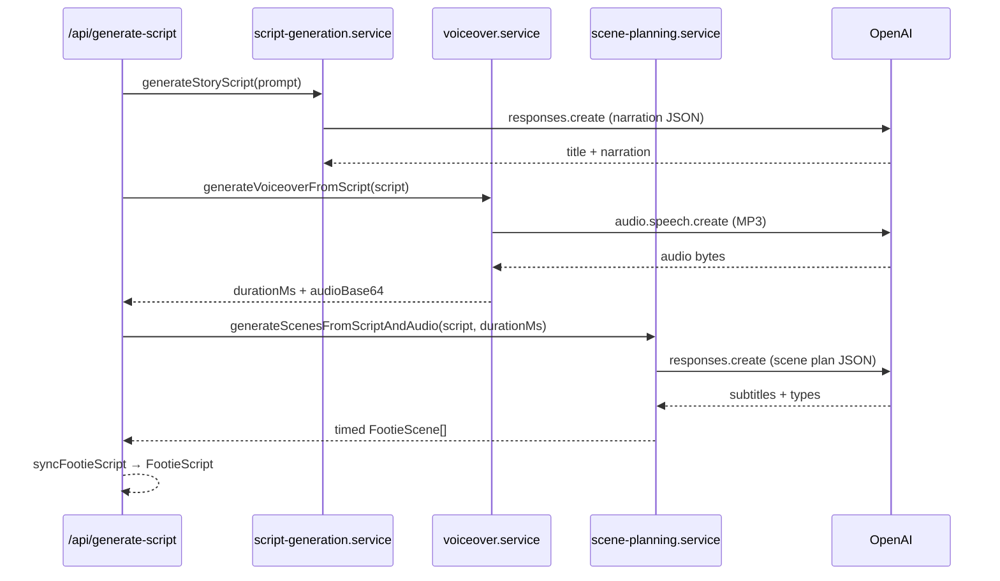
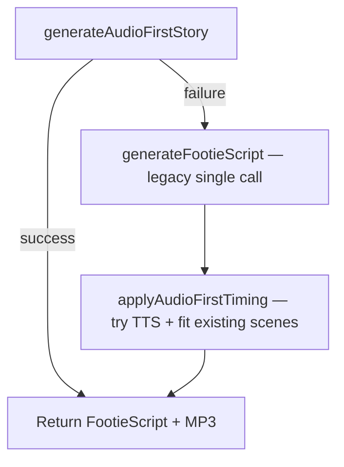

# Generation

The Generation layer turns a football topic into a complete, timed, narrated story ready for the editor. It runs **server-side only** and follows an **audio-first** design: narration and voiceover are created before visual scene planning.

**Orchestrator:** `generateAudioFirstStory()` in `src/features/story/services/audio-first-generation.service.ts`  
**Primary API:** `POST /api/generate-script` (`src/app/api/generate-script/route.ts`)

---

## Pipeline overview

```
Prompt
  ↓
Script generation
  ↓
Voice generation
  ↓
Scene planning
  ↓
Story creation
```



```mermaid
flowchart TD
  A[User prompt + tone + duration + sceneCount] --> B[Script generation]
  B --> C["StoryScript (title + narration)"]
  C --> D[Voice generation]
  D --> E["VoiceoverResult (MP3 + durationMs)"]
  E --> F[Scene planning]
  F --> G["FootieScene[] (subtitles + timings)"]
  G --> H[Story creation]
  H --> I["FootieScript + timelineItems + voiceover"]

  style E fill:#1a2e1a
  style I fill:#1a1a2e
```

Each stage produces a concrete artifact. Later stages depend on earlier ones; scene timings are never guessed from a target duration alone — they are derived from measured (or estimated) voiceover length.

---

## Stage 1 — Prompt

### What it is

The user's football brief plus generation controls assembled in the studio UI.

### Inputs

| Field | Source | Constraints |
|-------|--------|-------------|
| Topic | `BriefCanvas` in `CreateStoryFlow` | Required |
| Tone | UI selector | `dramatic`, `funny`, `tactical`, `news`, `emotional` |
| Duration | UI selector | 15–60 seconds (guides narration length) |
| Scene count | UI selector | 3–12 scenes (default 6) |
| Quality mode | UI selector | `cheap`, `balanced`, `best` → OpenAI model |
| Stream | Request flag | Optional NDJSON progress events |

### Where it goes

The topic and tone feed into two separate prompt builders in `src/lib/ai/prompts.ts`:

- **`buildStoryScriptPrompt()`** — narration-only script (Stage 2)
- **`buildScenePlanPrompt()`** — visual scene beats (Stage 4)

Tone guidance (`TONE_GUIDANCE`) shapes documentary writing style per tone — e.g. dramatic uses prestige sports documentary weight; tactical uses analytical clarity without jargon.

---

## Stage 2 — Script generation

### What it is

A single AI call that produces **`StoryScript`**: a title and one continuous narration block meant to be read aloud as the full voiceover. No scenes, no timestamps, no captions.

### Service

`generateStoryScript()` — `src/features/story/services/script-generation.service.ts`

### AI call

| Property | Value |
|----------|-------|
| API | OpenAI **Responses API** (`openai.responses.create`) |
| Model | `resolveScriptModel(qualityMode)` — `gpt-4.1-mini` (cheap) or `gpt-4.1` (balanced/best); overridable via `OPENAI_SCRIPT_MODEL` |
| Temperature | 0.7 |
| Max output tokens | 1200 |
| Output format | JSON with `title` and `narration` only |

### Prompt intent

The model is instructed to:

- Write one cohesive spoken script, not bullet points
- Open with a strong hook
- Target the requested spoken duration (±5 seconds)
- Avoid inventing exact scores, dates, or statistics unless stated in the brief
- Return JSON only — no markdown, no scenes

### Output

```typescript
interface StoryScript {
  id: string;
  title: string;
  narration: string;
  estimatedDurationMs?: number;  // from UI target, not measured audio
}
```

The `estimatedDurationMs` field records the user's target duration. It is **not** the source of truth for scene timing — that comes from Stage 3.

### Progress label

Step 1 of 4: *"Writing narration..."*

---

## Stage 3 — Voice generation

### What it is

Text-to-speech synthesis of the full narration. Produces an MP3 and — critically — a **`durationMs`** value used to time every scene.

### Service

`generateVoiceoverFromScript()` — `src/features/story/services/voiceover.service.ts`

### AI call

| Property | Value |
|----------|-------|
| API | OpenAI **Audio Speech API** (`openai.audio.speech.create`) |
| Model | `tts-1` |
| Voice | Default `alloy`; overridable via `voiceOptions` |
| Speed | Presets 0.75×–1.4× passed to TTS when supported |
| Input | Full narration text (max 4096 characters) |
| Output format | MP3 (`response_format: "mp3"`) |

This is **not** the Responses API — it is a separate TTS endpoint.

### Duration resolution

After MP3 bytes are returned, duration is resolved in `resolveVoiceoverDurationMs()` (`audio-first.utils.ts`):

1. **Measured** — parse MP3 frame headers via `getMp3DurationSeconds()` (preferred)
2. **Estimated** — word-count heuristic via `estimateNarrationDurationMs()` (fallback)

The result includes `metadata.durationSource: "measured" | "estimated"`. Estimated duration triggers a server warning log but still allows the pipeline to continue.

Speed adjustment: if TTS applies speed at generation time, duration reflects that. Otherwise `adjustVoiceoverDurationForSpeed()` adjusts downstream.

### Output

```typescript
interface VoiceoverResult {
  durationMs: number;
  provider: "openai";
  audioBase64?: string;
  metadata?: { voice, speed, model, durationSource };
}
```

On the primary generate path, MP3 is returned as base64 to the client, which creates a blob URL for `FootieScript.voiceoverUrl`.

### Progress label

Step 2 of 4: *"Generating voiceover..."*

### Standalone regeneration

`POST /api/generate-voiceover` calls the same `generateVoiceover()` function independently — used when the user edits narration or voice settings after initial story creation, without re-running the full pipeline.

---

## Stage 4 — Scene planning

### What it is

Designs **visual scene beats** — subtitles and optional scene types — mapped across the locked narration. The AI does **not** rewrite narration or output timestamps.

Two planners exist; **AI is the default**. Studio Intelligence runs only on the Review **scenes-only** path when dual gates pass (see [Studio Intelligence 3.5](./STUDIO_INTELLIGENCE.md#35-production-wiring-opt-in--dev-gated)).

### Service

`generateScenesFromScriptAndAudio()` — `src/features/story/services/scene-planning.service.ts`

### Default: AI scene planner

| Property | Value |
|----------|-------|
| API | OpenAI **Responses API** (`openai.responses.create`) |
| Model | Same as script generation |
| Temperature | 0.7 |
| Max output tokens | 1200 |
| Output format | JSON with exactly `sceneCount` scene objects |

Used when:

- `STUDIO_INTELLIGENCE_SCENE_PLAN_ENABLED` is not `true`, **or**
- `useStudioIntelligenceScenes` is false / omitted (default), **or**
- Studio Intelligence pipeline fails (automatic fallback)

### Opt-in: Studio Intelligence scene planner (3.5, scenes-only v1)

When **both** gates are open:

1. `STUDIO_INTELLIGENCE_SCENE_PLAN_ENABLED=true`
2. `useStudioIntelligenceScenes=true` (Review dev toggle; omitted by default)

Pipeline (`tryGenerateScenesFromStudioIntelligence`):

```
runStudioIntelligence → adaptSceneDensity → mapBlueprintsToScenes → materializeMappedScenesToFootieScript
```

**Fallback to AI** when env off, request flag false, SI failure, density adaptation failure, or materialized scene count mismatch. Response shape unchanged (`FootieScene[]` inside `FootieScript`).

**Not wired:** Audio-first `full` mode (`generateAudioFirstStory`) does not pass SI flags. Create one-shot flow unchanged.

**Dev/staging:** Review toggle hidden in production unless `NEXT_PUBLIC_STUDIO_INTELLIGENCE_SCENE_PLAN_TOGGLE=true`. Optional dev badge; no raw SI diagnostics in production UI.

### AI prompt intent

`buildScenePlanPrompt()` tells the model:

- The narration is **locked** — do not rewrite, extend, or shorten it
- Plan exactly N visual beats in playback order
- Each scene needs `id` and `subtitle` (short on-screen caption, max 12 words)
- Optional `sceneType`: `intro`, `context`, `match`, `transition`, `ending`
- Total voiceover duration and per-scene average are provided as **context only** — the model must not output timestamps

The full narration text is included in the prompt as read-only reference so subtitles align with what the narrator says at each beat.

### Timing application (non-AI)

After JSON parse, timing is applied programmatically — not by the model:

1. **`attachEvenVoiceoverTiming(scenes, voiceoverDurationMs)`** — splits measured voiceover duration evenly across all scenes
2. **`attachSceneNarrationFromScript(scenes, narration)`** — assigns per-scene narration excerpts by time window
3. **`applyGeneratedStorySceneCaptions(scenes)`** — sets default caption mode fields

Each scene receives contiguous `startMs`, `endMs`, `durationMs` (and second equivalents) that sum exactly to `voiceoverDurationMs`.

### Output

`FootieScene[]` with subtitles, types, narration excerpts, and voiceover-fitted timings. Scene content fields only — no images, no user edits yet.

### Progress label

Step 3 of 4: *"Planning scenes..."*

---

## Stage 5 — Story creation

### What it is

Assembly of the final **`FootieScript`** object consumed by the editor, preview, and export layers.

### Steps

1. **`syncFootieScript()`** — normalize scene settings, migrate legacy fields, recalculate cumulative timings
2. **`ensureTimelineItems(scenes)`** — build interleaved scene + default transition timeline items
3. **`buildAudioFirstGenerationResult()`** — package structured `AudioFirstGenerationResult`
4. **`footieScriptFromAudioFirst()`** — produce editor-ready `FootieScript`

### Final payload

```typescript
interface FootieScript {
  title: string;
  narration: string;
  totalDuration: number;           // seconds — sum of scene durations
  scenes: FootieScene[];
  timelineItems: TimelineItem[];
  voiceoverUrl?: string;           // set on client from base64 MP3
  voiceoverDurationMs?: number;
}
```

### API response

`GenerateScriptResponse` includes:

- `data` — normalized `FootieScript`
- `audioFirst` — full structured pipeline result
- `voiceoverAudioBase64` — MP3 when audio-first succeeds
- `audioFirstApplied: true` — scene timings were fitted to voiceover

### Client attachment

`page.tsx` receives the response and:

1. Stores `FootieScript` in React state
2. Creates blob URL from base64 MP3 → `voiceoverUrl`
3. Runs `syncFootieScript()` before editor/preview/export use

### Progress label

Step 4 of 4: *"Building storyboard..."*

---

## Why narration is generated before scenes

ShortForge Studio is **story-first**. The narration is the spine of the short; visuals and captions support what is being said, not the other way around.

### Design rationale

| Reason | Explanation |
|--------|-------------|
| **Coherent narrative** | One continuous documentary script avoids disconnected scene captions that feel like a slideshow |
| **TTS drives real timing** | Spoken duration depends on word choice, pacing, and voice — not a guessed seconds-per-scene split from the UI |
| **Scene plan is visual-only** | The second AI call focuses on subtitle beats and scene types without rewriting copy or inventing timestamps |
| **Separation of concerns** | Script writer optimizes for spoken prose; scene planner optimizes for visual rhythm |
| **Editor stability** | Narration text is stable before scenes attach; scene edits don't require re-generating the full script |

### What the old approach did

The legacy path (`generateFootieScript()`) asked the model to output title, narration, **and** timed scenes in a single JSON response. Scene durations were model-estimated from the target duration — not from actual audio. This often caused narration/audio length mismatches.

The audio-first pipeline inverts that: **write → speak → measure → plan visuals**.

---

## Why voice duration becomes the source of truth

The user's duration selector (e.g. 30 seconds) guides how long the AI **writes** the narration. It does not directly set scene `durationMs` values.

Once TTS runs, the **measured MP3 length** replaces the estimate as the timing authority.

### Why measured audio wins

```
Target duration (UI)     →  guides narration word count
Estimated duration (AI)  →  approximate, pre-TTS
Measured duration (MP3)    →  actual spoken length ← source of truth
```

| Factor | Impact |
|--------|--------|
| Word choice | Longer words take more time to speak |
| Punctuation | Pauses affect total length |
| Voice selection | Different voices have different pacing |
| Speed setting | 1.25× speed produces a shorter MP3 |
| TTS behaviour | Provider may pause differently than a word-count estimate |

### How it flows into scenes

`attachVoiceoverTimingMs(scenes, voiceoverDurationMs, weights)` in `timeline.utils.ts`:

- Divides `voiceoverDurationMs` across scenes using weights (even split on first generation: weight `1` per scene)
- Sets contiguous `startMs` → `endMs` with no gaps
- Sets `durationSource: "voiceover"` on fitted scenes

Story `totalDuration` = sum of fitted scene durations ≈ voiceover length in seconds.

### After generation

Manual scene duration edits in the editor set `durationSource: "manual"` and can cause visual timing to diverge from the unchanged voiceover MP3. The generation layer does not re-run automatically when the user edits durations.

---

## Current AI calls summary

On a successful audio-first generation, **three OpenAI calls** are made:

| # | Stage | API | Model | Purpose |
|---|-------|-----|-------|---------|
| 1 | Script generation | Responses API | `gpt-4.1-mini` or `gpt-4.1` | Title + narration JSON |
| 2 | Voice generation | Audio Speech API | `tts-1` | MP3 from narration |
| 3 | Scene planning | Responses API | `gpt-4.1-mini` or `gpt-4.1` | Scene subtitles + types JSON |



### Model selection

`src/lib/ai/script-models.ts`:

| Quality mode | Default model |
|--------------|---------------|
| cheap | `gpt-4.1-mini` |
| balanced | `gpt-4.1` |
| best | `gpt-4.1` |

Override all tiers with `OPENAI_SCRIPT_MODEL` environment variable.

### Token limits

| Call | Max output tokens |
|------|-------------------|
| Script generation | 1200 |
| Scene planning | 1200 |
| Legacy full script | 1800 |

---

## Fallback path

If `generateAudioFirstStory()` fails at any stage, `/api/generate-script` falls back:



| Path | AI calls | Timing source |
|------|----------|---------------|
| Audio-first (primary) | 3 calls | Measured voiceover |
| Legacy fallback | 1–2 calls | Model-estimated scenes, then TTS fit if `applyAudioFirstTiming` succeeds |

Legacy call uses `buildFootieScriptPrompt()` which asks the model to output scenes **with timestamps** in one JSON blob — the pre-audio-first approach.

Stream responses may include `usedFallback: true` on the complete event.

---

## File reference

| File | Role |
|------|------|
| `app/api/generate-script/route.ts` | HTTP entry, streaming, fallback orchestration |
| `app/api/generate-voiceover/route.ts` | Standalone TTS regeneration |
| `services/audio-first-generation.service.ts` | Pipeline orchestrator |
| `services/script-generation.service.ts` | Stage 2 — narration script |
| `services/voiceover.service.ts` | Stage 3 — TTS |
| `services/scene-planning.service.ts` | Stage 4 — AI or opt-in SI scene plan |
| `services/studio-intelligence-scene-plan.utils.ts` | Dual-gate SI pipeline (runtime → density → adapter → materializer) |
| `services/studio-intelligence-scene-plan.service.ts` | Server re-export of scene-plan utils |
| `services/story-generation.service.ts` | Legacy single-call generation |
| `services/story-parse.service.ts` | JSON cleaning and parsing |
| `lib/ai/prompts.ts` | Prompt templates |
| `lib/ai/script-models.ts` | Model selection |
| `lib/ai/openai.client.ts` | OpenAI client |
| `utils/timeline.utils.ts` | `attachEvenVoiceoverTiming`, `attachVoiceoverTimingMs` |
| `utils/audio-first.utils.ts` | Duration resolution, result packaging |
| `lib/utils/generateScriptStream.ts` | Client NDJSON consumer |

---

## Future improvements

### Pipeline reliability

- Structured retry with degraded scene count when scene plan parse fails
- Client-visible reason when fallback path is used (`usedFallback` exists but is not prominently surfaced)
- Generation analytics: success rate, latency, token usage per stage
- Content moderation on topic input and generated narration

### Timing accuracy

- Word-level forced alignment (e.g. Whisper timestamps) to map scene boundaries to spoken words instead of even splits
- Weighted scene durations from AI (dramatic beats get more time) while still summing to `voiceoverDurationMs`
- Auto re-fit scene durations when user regenerates voiceover or changes speed
- Reject or warn when estimated (not measured) duration is used

### Generation scope

- Partial regeneration — rewrite one scene's subtitle without full pipeline re-run
- Per-scene narration clips instead of one continuous MP3
- Multiple narration takes with A/B compare before committing
- Image prompt suggestions per scene (separate from subtitle planning)

### Performance and cost

- Cache narration script when only voice/scene count changes
- Parallel scene planning where safe (currently strictly sequential: script → voice → scenes)
- Cheaper TTS model tier for preview vs final export
- Shorter pipeline for "script only" mode without TTS (editor-first workflow)

### Developer experience

- OpenAPI schema for generate-script request/response
- Integration tests against mocked OpenAI responses
- Stage-level timeout and partial result recovery

---

## Related documentation

| Document | Contents |
|----------|----------|
| [ARCHITECTURE.md](./ARCHITECTURE.md) | Three-layer system overview |
| [DATA_MODEL.md](./DATA_MODEL.md) | `FootieScript`, `StoryScript`, voiceover types |
| [FEATURES.md](./FEATURES.md) | User-facing generation feature reference |
| [FUTURE.md](./FUTURE.md) | Broader technical debt and planned work |
