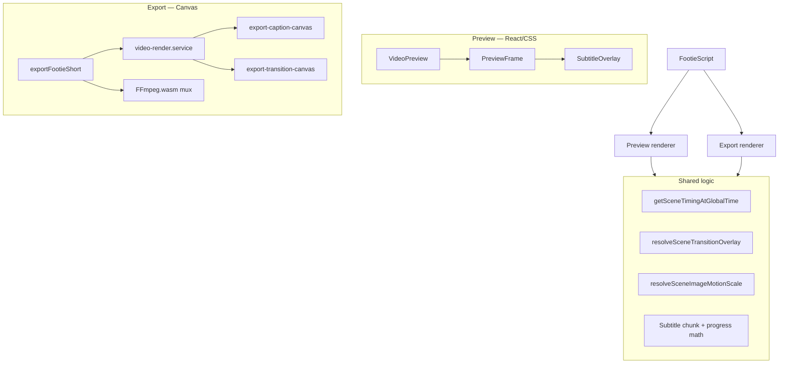

# Rendering

The Rendering layer turns `FootieScript` into visible frames. ShortForge Studio has two renderers that share timing, subtitle, transition, and image motion logic but use different output technologies:

| Renderer | Technology | Purpose |
|----------|------------|---------|
| **Preview** | React + CSS | Interactive playback in the studio |
| **Export** | Canvas 2D + MediaRecorder + FFmpeg.wasm | Downloadable WebM video |

Both read the same story state. Neither modifies it.

**Preview:** `src/features/preview/`  
**Export:** `src/features/export/`  
**Shared utilities:** `src/features/story/utils/`



---

## Preview vs Export

### Preview

**Entry:** `VideoPreview` → `PreviewFrame`  
**Hook:** `usePreviewPlayback`

Interactive playback inside a phone-style 9:16 device frame. Updates in real time as the user edits — no pre-render required.

| Aspect | Preview behaviour |
|--------|-------------------|
| Output | Live DOM/CSS on screen |
| Resolution | Screen-sized (responsive CSS) |
| Frame rate | Browser repaint (~60 fps display) |
| Audio | HTML `<audio>` element for narration MP3 |
| Title/branding | React text overlay at top |
| Subtitles | CSS pill (`SubtitleOverlay`) |
| Images | `SceneFrameImage` with CSS transforms |
| Transitions | Dual CSS layers with opacity/transform/filter |
| Cost | Low — no frame encoding |

**Playback modes:**

| Mode | Clock source | Scene selection |
|------|--------------|-----------------|
| **Narration** | `<audio>` `currentTime` → global `elapsedSec` | `getPreviewFrameAtTime()` from elapsed time |
| **Browser** | Per-scene timer (`previewClockMs`) | Selected scene index; auto-advance after scene duration |

Narration mode is the primary "watch my short" experience. Browser mode uses Web Speech API for scene excerpts (legacy/dev path) and steps scene-by-scene.

When paused or scrubbing by scene pill, preview shows the **selected scene** statically — not global timeline position.

### Export

**Entry:** `exportFootieShort()` → `exportSilentVideoBlob()`  
**File:** `video-render.service.ts`

Offline frame-by-frame render to a downloadable WebM file.

| Aspect | Export behaviour |
|--------|------------------|
| Output | WebM blob (VP9/VP8 via `MediaRecorder`) |
| Resolution | 720p, 1080p (default), 1440p, or 4K vertical |
| Frame rate | 30 fps fixed |
| Audio | Optional MP3 mux via FFmpeg.wasm after video render |
| Title/branding | Canvas text ("FOOTIEBITZ" + story title) |
| Subtitles | Canvas draw (`export-caption-canvas.utils.ts`) |
| Images | `drawSceneImageInFrame()` on offscreen canvas |
| Transitions | Canvas layer compositing (`export-transition-canvas.utils.ts`) |
| Cost | High — every frame drawn and encoded; 4K is memory-intensive |

**Export pipeline:**

```
1. buildFootieExportPayload()  — normalize scenes for render
2. Preload all scene images
3. Create offscreen canvas at export resolution
4. For each frame at 30 fps:
     clear → draw scene → draw transition → draw captions
     captureStream → MediaRecorder
5. (Optional) FFmpeg.wasm mux narration MP3 → final WebM
6. downloadBlob()
```

### Key differences summary

| Concern | Preview | Export |
|---------|---------|--------|
| Technology | React + CSS | Canvas 2D |
| Subtitle opacity | 0.65 + backdrop blur | 0.45, no blur |
| Subtitle font | 13–14px system UI | 64px Arial bold (scaled) |
| Gradient overlay | CSS `from-black/80` | Canvas linear gradient |
| Title placement | Top overlay in frame | Canvas draw with word wrap |
| Branding | Small "FootieBitz" label | "FOOTIEBITZ" watermark on every frame |
| Playback | Real-time, editable | Pre-rendered snapshot |
| Audio | Streamed during preview | Muxed post-render |
| Transition blur | CSS `filter: blur()` | Canvas blur (falls back to fade on failure) |

Layout rules are aligned: 90% max subtitle width, 3 visible lines, bottom-centred content-sized pill, same chunk selection and transition windows. Verify scripts (`test:export-subtitle-qa`, `test:transition-qa`, `test:timing-subtitle-qa`) guard parity.

---

## Scene timing

Scene timing determines **which scene is active** and **how far into that scene** the renderer is at any global moment.

### Timing model

Scenes have contiguous millisecond windows:

```
Scene 1: [0ms ──────────────── 3000ms)
Scene 2: [3000ms ───────────── 6000ms)
Scene 3: [6000ms ────────────── 9000ms)
```

Set by `recalculateSceneTimings()` in the editor. Initial values come from voiceover-fitted generation or manual duration edits.

### Shared resolver

**`getSceneTimingAtGlobalTime(scenes, globalMs)`** — `scene.utils.ts`

Returns:

| Field | Meaning |
|-------|---------|
| `slot.index` | Active scene index |
| `sceneElapsedMs` | Ms since this scene started |
| `sceneDurationMs` | This scene's length |

Both preview (narration mode) and export call this function.

### Preview timing

`getPreviewSceneTiming()` derives scene-local elapsed ms:

- **Narration mode:** maps `elapsedSec` from audio → `getSceneTimingAtGlobalTime()`
- **Browser mode:** uses per-scene wall clock from `previewClockMs - browserSceneStartedAtMs`

`getPreviewFrameAtTime(timelineItems, scenes, elapsedSec)` picks the active scene at a global second mark.

### Export timing

Export iterates `frameIndex / fps` seconds from 0 to `totalDurationSec`:

```typescript
totalDurationSec = max(getExportTotalDurationSec(payload), resolveStoryDurationSec(script))
totalFrames = round(totalDurationSec * 30)
```

Each frame: `resolveExportFrameTiming(scenes, timeSec)` → scene + `getSceneTimingAtGlobalTime()`.

### Duration authority

`resolveStoryDurationSec()` prefers **scene timeline ms sum** when available, then voiceover duration, then `totalDuration`. This keeps scene switches and subtitle chunks aligned after voice speed refits.

When manual scene durations diverge from voiceover length, visual timeline and audio length can differ in preview and export.

---

## Voice synchronization

Voice synchronization controls how narration audio relates to visual scene changes.

### Preview — narration mode

Primary sync path when user clicks Play with voiceover present:

1. `<audio src={voiceoverUrl}>` plays the full narration MP3
2. `timeupdate` / `requestAnimationFrame` reads `audio.currentTime`
3. `syncSceneToAudioTime(currentTimeSec)` updates `elapsedSec` and active scene index
4. Visual scene, subtitles, transitions, and Ken Burns all derive from `getSceneTimingAtGlobalTime()` at that global time

Narration is **one continuous track**. Scene boundaries are visual only — the audio is not split per scene.

Progress bar width = `elapsedSec / totalDuration` where `totalDuration` comes from `getStoryVoiceoverDurationSec()`.

### Preview — browser mode

Legacy/alternative path using Web Speech API:

- Speaks per-scene excerpt (`getSceneVoiceoverExcerpt`) or caption text
- Auto-advances after scene duration via `setTimeout`
- Not synced to the generated MP3

### Export

Video frames are timed by **scene duration sum** (visual timeline). Narration is muxed separately:

1. Silent WebM rendered at scene-timed frame count
2. If `audioMode === "with-voice"`: fetch narration blob → FFmpeg.wasm combines video + MP3

FFmpeg does not re-time frames to match audio length. If scene total ≠ voiceover duration (after manual edits), the muxed file may have mismatched lengths.

### Sync invariants

| Concern | Synced to |
|---------|-----------|
| Scene index (narration preview) | Audio `currentTime` → scene timing map |
| Subtitle chunk progress | `sceneElapsedMs / sceneDurationMs` |
| Ken Burns progress | Same scene elapsed ms |
| Transition overlay window | Final N ms of outgoing scene |
| Export frame index | Scene timing map (not audio clock) |

---

## Audio mix (Mixer v1)

**Audio Mixer v1** applies resolved stem gains in both preview and export. Entry point: `resolveAudioMixerSettings(script)` in `src/features/audio-mixer/`.

### Stem gains

| Bus | Gain | Notes |
|-----|------|-------|
| Voice | `voice.volume × master.volume` | Preview: Web Audio `GainNode` when > 100% |
| Music | `music.volume × master.volume` | Before ducking and fades |

Legacy drafts without `audioMixer` use defaults merged from `backgroundMusic`.

### Preview

- **Voice:** `usePreviewPlayback` → `AudioEngine.syncNarrationPreviewGain()`; peak protection via `DynamicsCompressorNode` when active
- **Music:** `resolvePreviewBackgroundMusicPlaybackVolume()` — ducking while narration plays, fade in/out envelopes
- **Parity:** Stem gain math matches export; voice boost uses Web Audio above 100%

### Export

Two mux paths share mix settings from `resolveExportBackgroundMusicMixSettings()`:

| Path | When | Audio processing |
|------|------|------------------|
| **Browser mix** | WebM with voice + music | `OfflineAudioContext` + Opus WebM stream-copy mux |
| **FFmpeg mix** | MP4 or fallback | Filter graph: voice chain + music chain (ducking expression) → `amix` → optional `alimiter` |

**Ducking (v1):** When enabled and voiceover is included, music gain is `musicGain × duckingStrength` for the full voiceover duration, then returns to full `musicGain`.

**Peak protection (v1):** When stem gain > 1.0 or Peak Protection is enabled — preview compressor; export post-mix FFmpeg `alimiter` (~0.98 ceiling).

Detail: [AUDIO_MIXER.md](./AUDIO_MIXER.md)

---

## Subtitle rendering

Two caption paths depending on `captionMode`. Both suppress captions during active transition overlays.

### Generated captions

Static AI scene subtitle for the full scene duration.

| | Preview | Export |
|---|---------|--------|
| Component | `CaptionOverlay` in frame footer | `drawExportGeneratedCaption()` |
| Source | `scene.subtitle` | `getExportSceneCaptionLines()` |
| Timing | Always visible (unless transition) | Always visible for scene window |
| Wrap | CSS `-webkit-line-clamp: 3` | Canvas word-wrap, max 3 lines |

### Timed subtitles (`captionMode: "subtitles"`)

Narration-derived chunks timed evenly across scene duration.

**Chunk selection (shared logic):**

- Preview: `getActiveSubtitleChunkState()` → `SubtitleOverlay`
- Export: `resolveExportSubtitleDisplay()` → `drawExportSubtitlesCaption()`

Both use the same chunk list from `splitSubtitleChunks()` and progress = chunk index + intra-chunk elapsed fraction.

**Visual presentation:**

| Property | Preview | Export |
|----------|---------|--------|
| Position | `bottom: 8%`, centred | `subtitleY = height - 320 × scale` |
| Max width | 90% | 90% (`SUBTITLE_MAX_WIDTH_RATIO`) |
| Pill | Content-sized, `rgba(0,0,0,0.65)`, blur | Content-sized, `rgba(0,0,0,0.45)` |
| Padding | 0.75rem × 1rem | 18px × 10px (scaled) |
| Radius | 1rem | 12px (scaled) |
| Font | 13–14px, weight 600 | 64px Arial bold (scaled) |
| Max lines | 3 (`-webkit-line-clamp`) | 3 (`wrapTextToLines`) |

**Subtitle effects:**

| Effect | Preview | Export |
|--------|---------|--------|
| fade-up | CSS `@keyframes subtitle-fade-up` | Canvas opacity + Y offset |
| typewriter | Progressive React text | Substring by chunk progress |
| highlight | CSS highlight pill per line | Canvas bar + growing pill per line |

Highlight mode skips the outer content box in export; draws per-line highlight pills instead.

---

## Transition rendering

Transitions are **tail overlays** on the outgoing scene — they do not extend timeline duration or appear as standalone segments.

### Shared resolver

**`resolveSceneTransitionOverlay()`** — `transition-overlay.utils.ts`

Given scene elapsed ms and transition metadata:

1. `clampOverlayTransitionDurationMs()` — cap at 40% of scene duration (default 500ms fallback)
2. Overlay window = final N ms of outgoing scene
3. Progress 0→1 across that window
4. Returns `{ effect, progress, fromScene, toScene }` or null outside window

Captions are **hidden** when overlay is active (both renderers).

### Preview rendering

Dual-layer CSS compositing in `PreviewFrame`:

- **From layer:** outgoing scene backdrop with `getTransitionLayerStyles().from`
- **To layer:** incoming scene backdrop with `.to` styles

Styles include `opacity`, `transform` (translateX, scale), and `filter: blur()`.

`getTransitionLayerStyles()` in `previewTimeline.ts` — shared with export transition math.

Ken Burns on from-layer uses `transitionFromMotionProgress` (scene elapsed). To-layer starts at progress 0.

### Export rendering

`drawExportTransitionBackgrounds()` in `export-transition-canvas.utils.ts`:

1. Parses the same `getTransitionLayerStyles()` into canvas draw states
2. Draws from-scene background with opacity/transform/blur
3. Draws to-scene background composited on top
4. **Cut** = no-op (instant scene swap at window start)
5. **Blur** = canvas filter; falls back to fade if draw fails

Transition card editor label ("Transition to next scene") is never drawn in preview or export.

### Supported effects

`cut`, `fade`, `slide-left`, `slide-right`, `zoom-in`, `zoom-out`, `blur`

---

## Ken Burns rendering

Ken Burns adds slow zoom motion during scene playback, multiplied on top of manual pan/zoom.

### Shared math

**`resolveSceneImageMotionProgress(sceneElapsedMs, sceneDurationMs)`** — linear 0→1 over scene  
**`resolveSceneImageMotionScale(motion, progress)`** — returns additional scale multiplier

| Type | Scale over progress |
|------|---------------------|
| `none` | 1.0 (no motion) |
| `zoom-in` | 1.0 → peak (1.05 / 1.10 / 1.16 by intensity) |
| `zoom-out` | peak → 1.0 |

Settings: `SceneImage.imageMotion.type` and `.intensity`.

### Preview rendering

`SceneBackdrop` → `SceneFrameImage` with `motionScale` prop:

- CSS `transform: scale()` applied to image element
- Progress from `getPreviewSceneTiming()` scene elapsed ms
- Updates every frame during narration playback

During transition overlay, from-scene uses current motion progress; to-scene uses 0.

### Export rendering

`drawSceneImageInFrame(ctx, img, scene, width, height, scale, motionScale)`:

- Reads manual pan/zoom/fit from `SceneImage`
- Multiplies user `scale` by `motionScale`
- Called once per frame with progress from export frame timing

Ken Burns is deterministic — same scene elapsed ms produces the same scale in preview and export.

---

## Export quality and delivery

### Quality presets

| ID | Resolution | FPS | Bitrate |
|----|------------|-----|---------|
| 720p | 720×1280 | 30 | 4 Mbps |
| 1080p | 1080×1920 | 30 | 8 Mbps |
| 1440p | 1440×2560 | 30 | 12 Mbps |
| 4k | 2160×3840 | 30 | 20 Mbps |

Scale factor `scale = height / 1280` scales fonts, padding, and draw constants.

### Audio mux

`ffmpeg.utils.ts` — singleton FFmpeg.wasm loaded from CDN:

- Input: silent `video.webm` + `audio.mp3`
- Output: `output.webm` with narration track
- Skipped for silent export

### Progress states

`preparing` → `rendering` → (`loading-voiceover` → `combining`) → `complete` | `error`

When voiceover is included, rendering progress is capped at 70% until mux completes.

---

## Known limitations

### Preview vs export visual differences

- Subtitle pill opacity, blur, font size, and padding differ (see table above)
- Export draws "FOOTIEBITZ" branding and story title on every frame; preview shows a smaller header
- Export adds a stronger canvas gradient overlay for text legibility
- Preview resolution ≠ export resolution — framing may look slightly different at 4K

### Voice / visual drift

- Manual scene duration edits change visual timing without re-stretching the voiceover MP3
- Export video length follows scene sum; muxed audio follows MP3 length — can diverge
- No runtime warning when visual total ≠ voiceover duration

### Subtitle timing

- Chunks divide scene duration evenly — not aligned to spoken words in audio
- No phoneme-level or word-level forced alignment
- Overflow beyond 3 wrapped lines is clipped

### Transitions

- **Cut** is instant — no crossfade pixels between two full scene images outside the overlay window
- Canvas **blur** may fall back to fade on draw failure
- Overlay capped at 40% of scene — very short scenes get very short transitions

### Export format and performance

- **WebM only** — no MP4/H.264
- **4K export** is memory-intensive; may fail on low-end devices
- **FFmpeg.wasm** adds initial load time and bundle weight
- **CORS** — remote image URLs may fail canvas draw; falls back to placeholder
- **SSR** — export throws if not in browser
- Frame loop is main-thread — no worker offload

### Preview limitations

- No fullscreen mode or share link
- No frame-accurate timeline scrubber across full short
- Paused state shows selected scene, not global playhead position
- Browser speech mode is not representative of final narration quality

---

## Planned improvements

### Visual parity

- Shared style tokens between CSS variables and canvas constants (opacity, padding, radius)
- Side-by-side preview vs export pixel comparison tool
- Optional export without per-frame branding watermark

### Voice synchronization

- Runtime warning when scene total diverges from voiceover duration
- "Re-fit to voiceover" action before export
- Per-scene narration clips aligned to scene windows
- Word-level subtitle timing from audio forced alignment (Whisper timestamps)

### Subtitles

- Manual chunk boundary editor
- Scene-level subtitle lead/lag offset
- Unified pill opacity (0.45 vs 0.65 alignment)

### Transitions

- True dual-image crossfade showing both scenes simultaneously throughout transition
- GPU-friendly blur shader for export (eliminate fade fallback)
- Easing curve selection

### Ken Burns

- Ease-in/out curves instead of linear only
- Combined pan + zoom motion paths
- Motion preview scrubber in editor

### Export performance and format

- Worker-based frame rendering
- MP4/H.264 where browser encoders allow
- Export progress time estimate
- Partial export (selected scenes only)
- Playwright smoke test in CI for export output

### Preview UX

- Full timeline scrubber with thumbnail strip
- Fullscreen preview
- Real-time audio/visual drift indicator

See also [FUTURE.md](./FUTURE.md) and [ROADMAP.md](../ROADMAP.md).

---

## File reference

```
src/features/preview/
├── components/
│   ├── VideoPreview.tsx          # Playback controls + composition
│   ├── PreviewFrame.tsx          # Device frame, layers, transitions
│   ├── SubtitleOverlay.tsx       # Timed subtitle pill
│   └── CaptionOverlay.tsx        # Generated caption
├── hooks/
│   └── usePreviewPlayback.ts     # Clock, narration sync, play state
└── utils/
    ├── previewTimeline.ts        # getPreviewFrameAtTime, transition CSS
    └── previewSceneTiming.ts     # Scene-local elapsed ms

src/features/export/
├── services/
│   ├── video-render.service.ts   # Frame loop, MediaRecorder
│   └── export-payload.service.ts   # Render snapshot normalization
└── utils/
    ├── export-caption-canvas.utils.ts
    ├── export-transition-canvas.utils.ts
    ├── export-subtitle.utils.ts
    ├── ffmpeg.utils.ts
    └── export-quality.utils.ts

src/features/story/utils/
├── scene.utils.ts                # getSceneTimingAtGlobalTime, drawSceneImageInFrame
├── transition-overlay.utils.ts   # resolveSceneTransitionOverlay
├── scene-image-motion.utils.ts   # Ken Burns math
├── subtitle-timing.utils.ts      # Preview chunk state
└── subtitle-effect.utils.ts      # Effect frame calculations
```

---

## Related documentation

| Document | Contents |
|----------|----------|
| [ARCHITECTURE.md](./ARCHITECTURE.md) | Rendering layer in system context |
| [EDITING.md](./EDITING.md) | Controls that affect render output |
| [GENERATION.md](./GENERATION.md) | Initial timing from voiceover |
| [FEATURES.md](./FEATURES.md) | Preview and export feature reference |
| [FUTURE.md](./FUTURE.md) | Technical debt and planned work |
